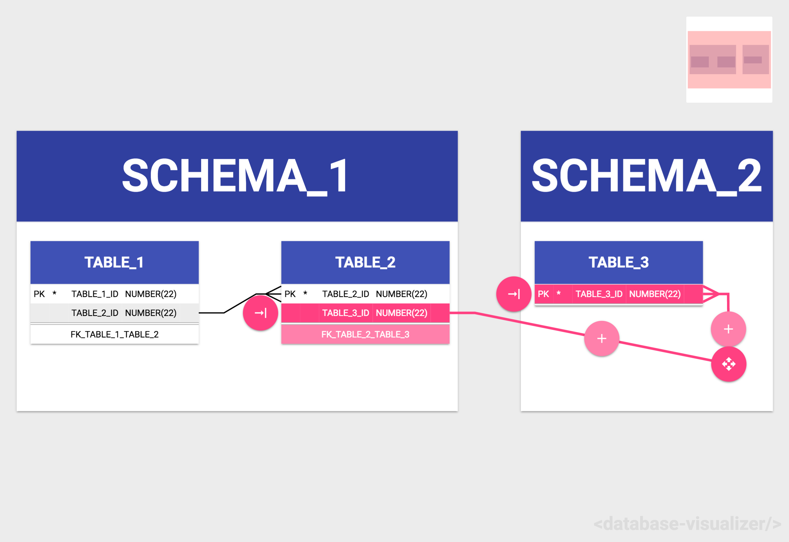

# DatabaseVisualizer Add-on for Vaadin 7

DatabaseVisualizer is a UI widget wrapper around the [Polymer Webcomponent](https://github.com/thorbenvh8/polymer-database-visualizer) add-on for Vaadin 7.

## Online demo

Try the polymer add-on demo [here](https://thorbenvh8.github.io/polymer-database-visualizer/demo/)



## Download release

Official releases of this add-on are available at Vaadin Directory. For Maven instructions, download and reviews, go to https://vaadin.com/directory#!addon/databasevisualizer-add-on

## Building and running demo

    git clone https://github.com/thorbenvh8/vaadin-database-visualizer-root.git
    mvn clean install
    cd vaadin-database-visualizer-demo
    mvn jetty:run

To see the demo, navigate to http://localhost:8080/

## Development with Eclipse IDE

For further development of this add-on, the following tool-chain is recommended:
- Eclipse IDE
- m2e wtp plug-in (install it from Eclipse Marketplace)
- Vaadin Eclipse plug-in (install it from Eclipse Marketplace)
- JRebel Eclipse plug-in (install it from Eclipse Marketplace)
- Chrome browser

### Importing project

Choose File > Import... > Existing Maven Projects

Note that Eclipse may give "Plugin execution not covered by lifecycle configuration" errors for pom.xml. Use "Permanently mark goal resources in pom.xml as ignored in Eclipse build" quick-fix to mark these errors as permanently ignored in your project. Do not worry, the project still works fine. 

### Debugging server-side

If you have not already compiled the widgetset, do it now by running vaadin:install Maven target for vaadin-database-visualizer-root project.

If you have a JRebel license, it makes on the fly code changes faster. Just add JRebel nature to your vaadin-database-visualizer-demo project by clicking project with right mouse button and choosing JRebel > Add JRebel Nature

To debug project and make code modifications on the fly in the server-side, right-click the vaadin-database-visualizer-demo project and choose Debug As > Debug on Server. Navigate to http://localhost:8080/vaadin-database-visualizer-demo/ to see the application.

### Debugging client-side

Debugging client side code in the vaadin-database-visualizer-demo project:
  - run "mvn vaadin:run-codeserver" on a separate console while the application is running
  - activate Super Dev Mode in the debug window of the application or by adding ?superdevmode to the URL
  - You can access Java-sources and set breakpoints inside Chrome if you enable source maps from inspector settings.
 
## Release notes

### Version 0.0.1-SNAPSHOT
- init

## Roadmap

This component is developed as a hobby with no public roadmap or any guarantees of upcoming releases. That said, the following features are planned for upcoming releases:
- any ideas? :)

## Issue tracking

The issues for this add-on are tracked on its github.com page. All bug reports and feature requests are appreciated. 

## Contributions

Contributions are welcome, but there are no guarantees that they are accepted as such. Process for contributing is the following:
- Fork this project
- Create an issue to this project about the contribution (bug or feature) if there is no such issue about it already. Try to keep the scope minimal.
- Develop and test the fix or functionality carefully. Only include minimum amount of code needed to fix the issue.
- Refer to the fixed issue in commit
- Send a pull request for the original project
- Comment on the original issue that you have implemented a fix for it

## License & Author

Add-on is distributed under Apache License 2.0. For license terms, see LICENSE.txt.

DatabaseVisualizer is written by Thorben von Hacht

# Developer Guide

## Getting started

Here is a simple example on how to try out the add-on component:

```java
DatabaseVisualizer visualizer = new DatabaseVisualizer();

DatabaseVisualizerSchema schema = new DatabaseVisualizerSchema();
schema.setId(1L);
schema.setName("schema");
schema.addTable(table1);
schema.addTable(table2);
        
DatabaseVisualizerDatabase database = new DatabaseVisualizerDatabase();
database.addSchema(schema);
        
visualizer.setDatabase(database);
```

For a more comprehensive example, see src/main/java/org/vaadin/addons/demo/DemoUI.java
